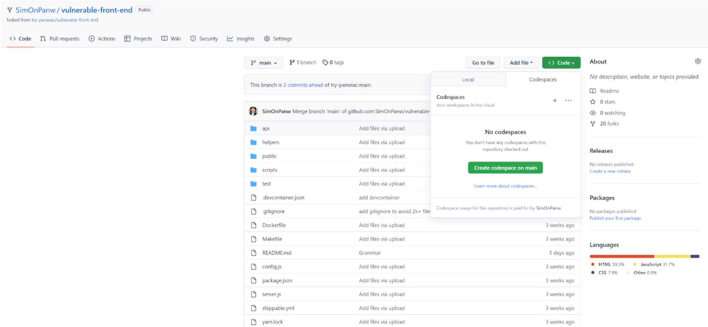
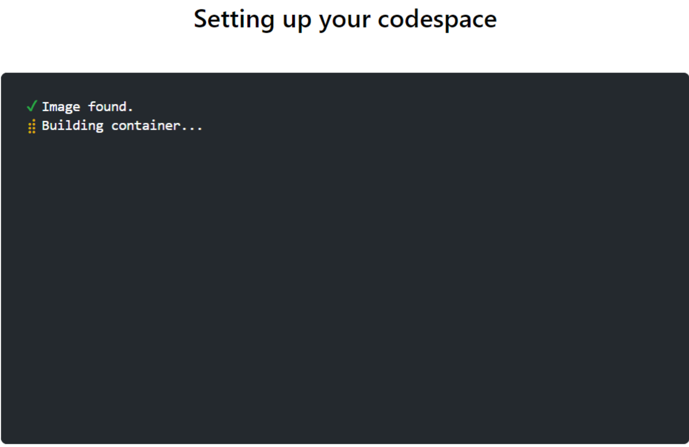

# Demo Code Security by Prisma Cloud with a Vulnerable Front-End

## Use case: Implement Logging Middleware

To create the logging functionality needed for the new website, you have decided to reach for a third party open source software package called 'morgan'. This package provides HTTP request logger middleware functionality.

## Create a new branch

```
git checkout -b ccs-feature-branch
```

## Install vulnerable code dependency

- Read about the ‘morgan’ package at https://yarnpkg.com/package/morgan
- Using the Vscode terminal window, install the 'morgan' package at version 1.0.0:

```
yarn add morgan@1.0.0 -E
```

## Open package.json in VS Code

Checkov should find a vulnerability in the morgan dependecy

## Run a local Checkov scan

You may find it preferable to configure environment variables for the Prisma API URL and API Key rather than specifying them as arguments to Checkov. Feel free to use whatever method you like best.

```
export MY_PRISMA_API_URL="https://apix.prismacloud.io" (where x=app stack)
export MY_PRISMA_KEY="<AccessKey>::<SecretKey>"
```

- Using the Vscode terminal window, run a local Checkov scan:

```
checkov -f yarn.lock --bc-api-key $MY_PRISMA_KEY --prisma-api-url $MY_PRISMA_API_URL  --repo-id $USER/scascan --use-enforcement-rules
```

- Alternatively, if you have docker installed you may use this command:

```
docker run --rm -v $PWD:/checkovScan -w /checkovScan bridgecrew/checkov:latest -f yarn.lock --bc-api-key $MY_PRISMA_KEY --prisma-api-url $MY_PRISMA_API_URL --repo-id $USER/scascan --use-enforcement-rules
```

## Check in Your Code to GitHub

```
git add .
git commit -m "add morgan 1.0.0 depedency"
git push --set-upstream origin ccs-feature-branch
```

## Initiate a Pull Request (PR) from GitHub

- Open your repo on github.com
- Click the Compare & pull request button
- Double check to make sure you are merging into your own repo!
- Click the 'Create Pull Request' button
- Watch Prisma Cloud perform a code review. Think of the Prisma Cloud code review this way: A Senior Developer on the team (who is super knowledgeable about security) reviews the code and checks to make sure everything is being done correctly and securely. That developer happens to be a Prisma Cloud bot.

## Reset demo environment

```console
git checkout main
git branch -D ccs-feature-branch
git push origin --delete ccs-feature-branch
```

## [OPTIONAL] Use Github Codespaces

- Click the `<> Code button`, then click the `Codespaces` tab.
  

- Click `Create codespace on main`.

- It will start building a container based on the `./devcontainer/Dockerfile`
  

- Once the build is completed, your VS Code will start in your browser
  
